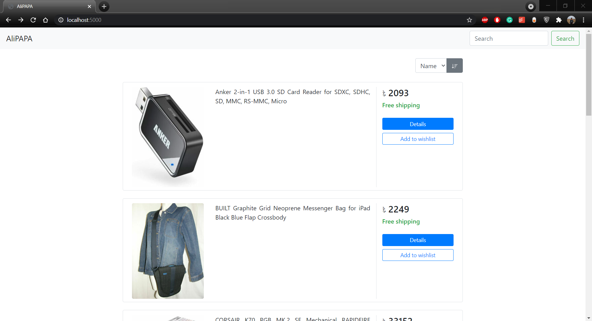

# AliPAPA
Simple e-commerce demo website created using express js.  
Couldn't scrape from amazon even after using puppeteer because of product information not being present in the html so I went with ebay instead. Product name, price and image are scraped from the product link before added to the html.  
All the scraping now happens in client site instead of server side, so everything is fast and snappy. [http://www.whateverorigin.org](http://www.whateverorigin.org) has been used for bypassing the CORS error.

## Stuffs Used
- Express.js
- MySQL(xampp)
- ejs templatig engine

## Instructions
- Install node js
- Run `npm install` on cli to install dependencies
- Create database named 'alipapa' and import from products.csv on the database folder
- Start server for database(port 3306 probably)
- Run `npm start` to start the project on probably [http://localhost:5000/](http://localhost:5000/)

## Screenshot

